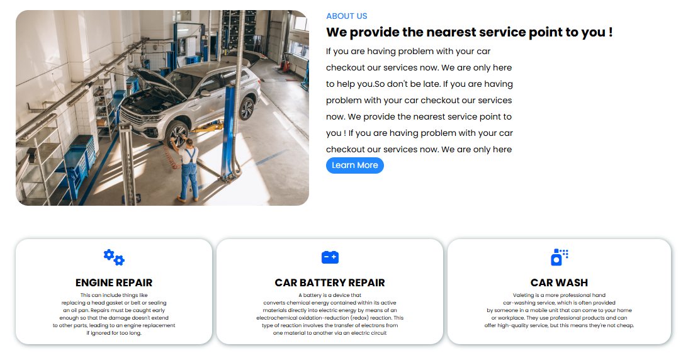
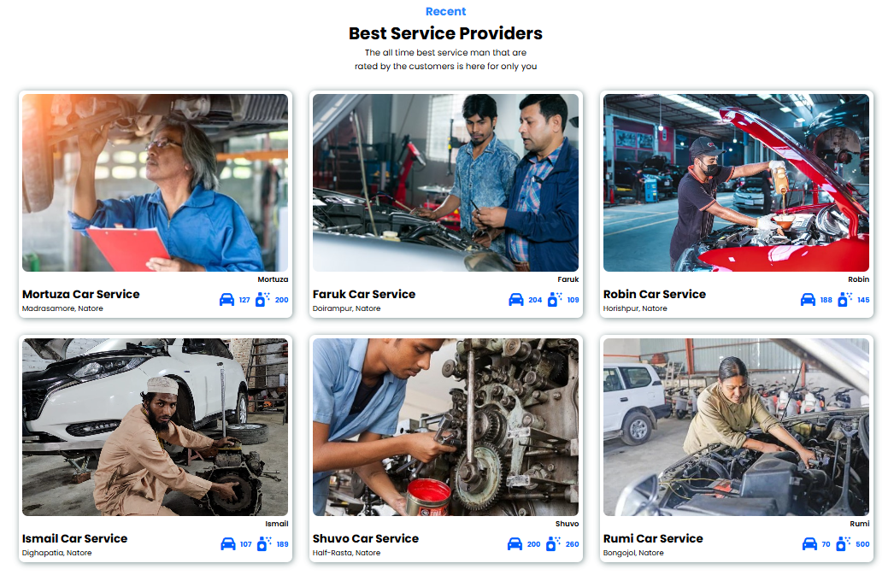
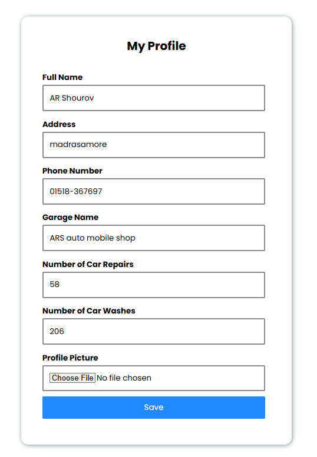
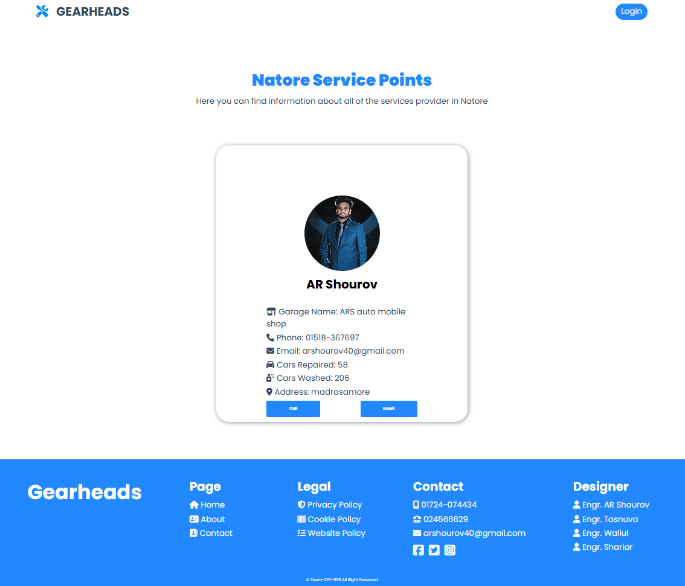

<div align="center">

# ⚙️ Gearheads

**A local car-service directory that connects car owners with nearby garages and service providers.**


</div>

---

## 📖 Table of Contents

- [About the Project](#-about-the-project)
- [Features](#-features)
- [Screenshots](#-screenshots)
- [Tech Stack](#-tech-stack)
- [Project Structure](#-project-structure)
- [Getting Started](#-getting-started)
- [How to Use](#-how-to-use)
- [Database Schema](#-database-schema)
- [Troubleshooting](#-troubleshooting)
- [Known Limitations](#-known-limitations)
- [Future Improvements](#-future-improvements)
- [Hosting Note](#-hosting-note)
- [Team](#-team)

---

## 🚗 About the Project

Finding a trustworthy garage is hard, especially outside big cities. **Gearheads** is a web application that lets car owners browse local car repair and car wash providers by area, and lets providers create their own profile so customers can find and contact them.

The project was developed by students of **Bangladesh Army University of Engineering & Technology (BAUET)**, Department of CSE, as a submission for:

- **CSE-3110**: Web Programming Sessional
- **CSE-3104**: Software Engineering and Information System Design Sessional

Currently the directory covers areas around **Natore, Bangladesh** (Natore and Doirampur).

## ✨ Features

- 🏠 **Landing page** with an overview, services, and top service providers
- 📍 **Area-based search**: choose an area and see every provider registered there
- 📝 **Provider registration and login** with session handling
- 👤 **Provider profile** showing name, email, and profile picture
- ✏️ **Profile update**: garage name, address, phone, repair/wash counts, and photo upload
- 📞 **Contact buttons** on each provider card (call or email)
- 📱 **Responsive layout** with a mobile navigation menu

## 🖼️ Screenshots

> Place your screenshots in a `screenshots/` folder using the file names below.

| Home Page | About Us |
|:---:|:---:|
|  | 

| Best Service Providers | Questionaries section and Contacts |
|:---:|:---:|
|  | 

| Login | Sign Up |
|:---:|:---:|
|  |  |

| Profile | Update Profile |
|:---:|:---:|
|  |  |

| Service Provider List Under Specific Area |
|:---:|
|  |

### Use Case Diagram

<p align="center">
  
</p>

## 🛠️ Tech Stack

| Layer | Technology |
|---|---|
| Frontend | HTML5, CSS3 (custom stylesheet), Font Awesome, Google Fonts (Poppins) |
| Backend | PHP (sessions, file uploads, `mysqli`) |
| Database | MySQL / MariaDB |
| Local server | XAMPP (Apache + MySQL) |
| Tools | VS Code, Git, GitHub |

## 📂 Project Structure

```
Gearheads/
├── index.php            # Landing page
├── sign-up.php          # Provider registration
├── login.php            # Login
├── profile.php          # Logged-in provider profile
├── update.php           # Edit profile and upload photo
├── natore.php           # Providers in Natore
├── doirampur.php        # Providers in Doirampur
├── DB_connection.php    # Database connection settings
├── database.sql         # Database and table setup
├── style.css            # Site styling
├── images/              # Site images and uploaded profile pictures
├── screenshots/         # README screenshots
└── project related file/  # Proposal documents
```

## 🚀 Getting Started

### Prerequisites

- [XAMPP](https://www.apachefriends.org/) (or any Apache + PHP + MySQL stack). PHP 7.4 or newer is recommended.
- A web browser
- Git (optional)

### Installation

**1. Get the code**

```bash
https://github.com/ARShourov/Gearheads.git
```

Or download the ZIP from GitHub and extract it.

**2. Move it into your web server folder**

Copy the project folder into XAMPP's `htdocs` directory and name it `Gearheads`:

```
C:\xampp\htdocs\Gearheads
```

**3. Start the servers**

Open the XAMPP Control Panel and start **Apache** and **MySQL**.

**4. Create the database**

1. Open [http://localhost/phpmyadmin](http://localhost/phpmyadmin)
2. Go to the **Import** tab
3. Choose `gearheads.sql` from the project folder and click **Import**

This creates the `gearheads` database and the `signup` table.

**5. Check the connection settings**

`DB_connection.php` uses the XAMPP defaults. Change them only if your setup is different:

```php
$con = mysqli_connect("localhost", "root", "", "gearheads");
```

> The database name `gearheads` is spelled this way on purpose. It must match in both `DB_connection.php` and `gearheads.sql`.

**6. Open the website**

Go to [http://localhost/Gearheads/index.php](http://localhost/Gearheads/index.php)

## 📘 How to Use

**As a customer**

1. Open the home page and use the **Area** dropdown.
2. Pick an area (Natore or Doirampur).
3. Browse the provider cards and use **Call** or **Email** to get in touch. No account is needed.

**As a service provider**

1. Click **Sign Up** and create an account.
2. **Log in**, then click **Update Profile**.
3. Fill in your garage name, phone, repair and wash counts, upload a photo, and set your **address** to one of the supported village names below.
4. Your card now appears on the matching area page.

**Supported area names**

An address must match one of these names to appear on an area page:

| Page | Accepted addresses |
|---|---|
| `doirampur.php` | doirampur, walia, malonchi, dhupoil, kajipara, shongkorvag, dorabpur, sonapur, jathiyan |
| `natore.php` | madrasamore, horishpur, vowaniganj, kanaikhali, dighapatia, bongojol, bonbelghoria, bonpara, jelepara |

To add an area, copy `natore.php`, change its village list, and link it from the dropdown in `index.php`.

## 🗄️ Database Schema

Database: `gearheads`, table: `signup`

| Column | Type | Description |
|---|---|---|
| `id` | INT, auto-increment, primary key | Unique user ID |
| `fname` | VARCHAR(100) | Full name |
| `email` | VARCHAR(150) | Login email |
| `phone` | VARCHAR(30) | Contact number |
| `pass` | VARCHAR(255) | Password |
| `uaddress` | VARCHAR(100) | Area or village (used for filtering) |
| `garage_name` | VARCHAR(150) | Garage name |
| `car_repair_count` | INT | Number of cars repaired |
| `car_wash_count` | INT | Number of cars washed |
| `profile_picture` | VARCHAR(255) | Path to uploaded image |

## 🩺 Troubleshooting

| Problem | Fix |
|---|---|
| Apache won't start | Another program (such as Skype) is using port 80. Change Apache's port in XAMPP and visit `http://localhost:8080/Gearheads/`. |
| "Database connection failed" | Make sure MySQL is running and `gearheads.sql` was imported. |
| Area page is empty | A provider must sign up and set an address that matches the lists above. |
| Profile picture won't upload | Make sure the `images/` folder exists and is writable. |
| Old styles after an update | Hard-refresh with `Ctrl + F5`. |

## ⚠️ Known Limitations

This is an academic project. Before using it with real users or on a public server, be aware that:

- Passwords are stored in plain text and should be hashed (`password_hash()` / `password_verify()`).
- Database queries are built from user input and should be converted to prepared statements.
- File uploads are not restricted by type or size.
- Every account is both a customer and a provider; there are no separate roles.

## 🔮 Future Improvements

These were proposed in the project plan but are not implemented yet:

- [ ] Online booking and scheduling
- [ ] Transparent service pricing
- [ ] 24/7 emergency roadside assistance
- [ ] Ratings and reviews
- [ ] Admin panel for managing providers and areas
- [ ] More areas, then nationwide coverage
- [ ] Secure authentication and prepared statements

## 👥 Team

**Team Gearheads**, CSE 15th Batch, BAUET (Session 2021-22)

- Engr. Md. Abdur Rahman Shourov (Team Leader)
- Engr. Mst. Sumaiya Tasnuva (Profile & Update profile designer)
- Engr. Md. Waliul Islam (Database Management)
- Engr. S.M. Shariar Hossain (Area section designeer)

---

<div align="center">

Made with ❤️ by Team Gearheads

</div>
